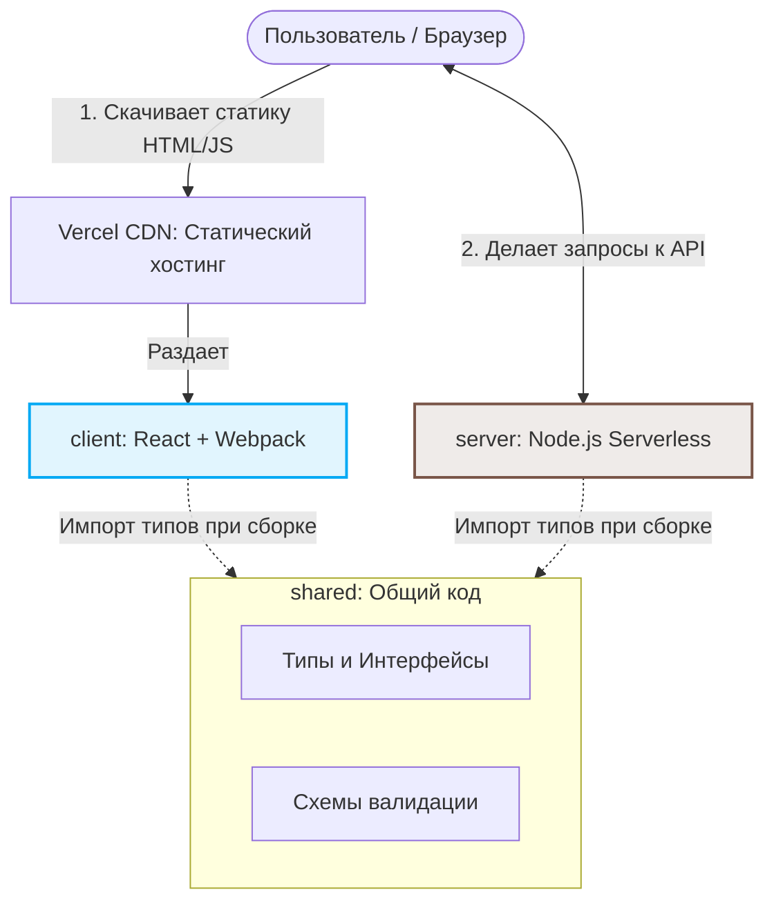

# 🌐 Архитектура проекта (TS Monorepo)

Проект развернут на **Vercel** и разделен на три изолированные зоны ответственности с общей типобезопасностью.

---

## 🏗 Структура и Схема

```text
├── client/   # Frontend (React + Webpack) -> Собирается в статику и раздается через CDN
├── server/   # Backend (Node.js) -> Деплоится как Serverless-функции
└── shared/   # Общие схемы и типы
```



---

## 📦 Зоны ответственности

1. **`./shared` (Общий слой)**
   - **Что внутри:** Интерфейсы ответов API, схемы валидации (Zod/Yup).
   - **Зачем:** Синхронизация изменений. Если меняется тип в API, код автоматически обновляется (и ломается при ошибках) и на фронте, и на бэке.

2. **`./server` (Бэкенд)**
   - **Специфика:** Работает в режиме **Vercel Serverless**. Точки входа — строго внутри `server/api/`.
   - **Важно:** Функции работают без сохранения состояния (stateless).

3. **`./client` (Фронтенд)**
   - **Специфика:** Чистая статика (SPA). Webpack собирает проект в HTML/JS/CSS, а Vercel мгновенно раздает эти файлы через свою сеть CDN по всему миру.

---

## 🛠 Памятка разработчику

- **Установка:** Зависимости всех папок ставятся одной командой из корня (`npm install` через Workspaces).
- **Локальный запуск:** Используйте Vercel CLI для симуляции продакшна: команда `vercel dev`.
- **Главное правило:** Запрещен прямой импорт между `client` и `server`. Все общие сущности выносятся только в `shared`.
